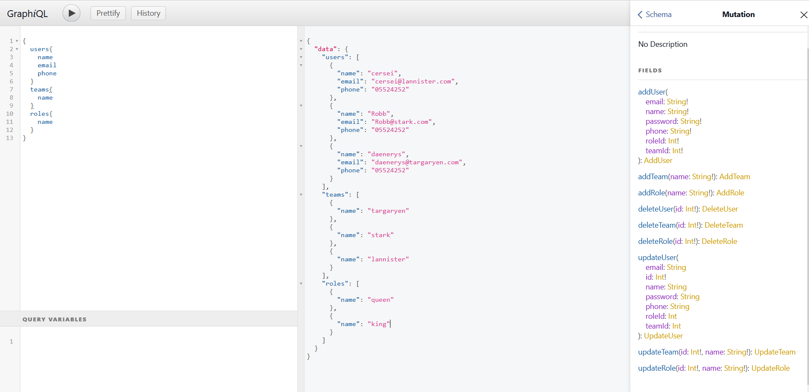

# GraphQl in Flask
sample Project | Python | Flask | GraphQl

## Requirements
- Python3
- PostgreSQL/Sqlite/...
- Pipenv

## Install
```
- pip install pipenv
- pipenv install
- pipenv shell
```

## Usage
- Create .env file, and copy the below configuration.

```
FLASK_DEBUG=1
FLASK_APP=app.py
SECRET_KEY=<YOURSECRETKEY>
LOG_LEVEL = DEBUG
LOG_FILE = project.log
SQLALCHEMY_DATABASE_URI = <SQLALCHEMY_DATABASE_URI>
SQLALCHEMY_COMMIT_ON_TEARDOWN = True
SQLALCHEMY_TRACK_MODIFICATIONS = True
```

 - To run the app:
```
 python app.py
```
 - To run queries in the Graphql Apis interface:
```
 {BaseUrl}/graphql-api
```
## Example 
- Mutation
```
mutation {
  addUser(name: "test", password: "012345", email: "test@test.com", phone: "00000000000", roleId: 1, teamId: 1) {
    user {
      name
      phone
    }
  }
}
```
- Query
```
{
  getTeamById(name: "team-test") {
    name
  }
  users{
    name
    email
    phone
  }
}
```

(Sample data added for fun :blush:)

